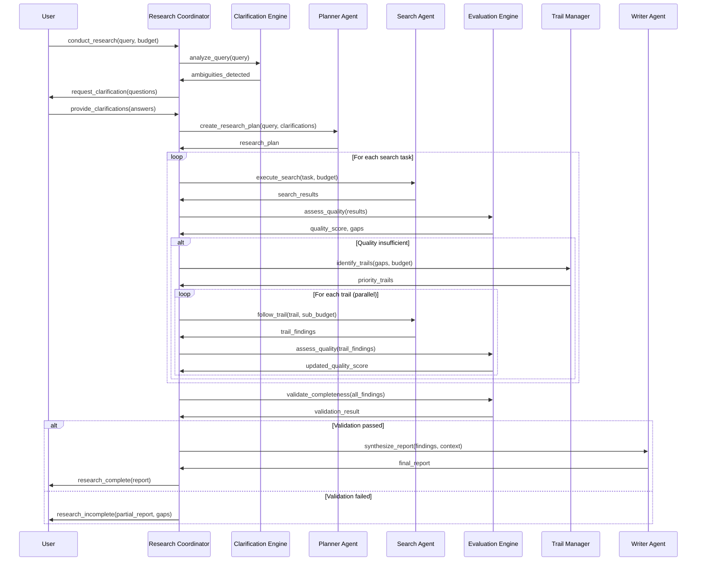
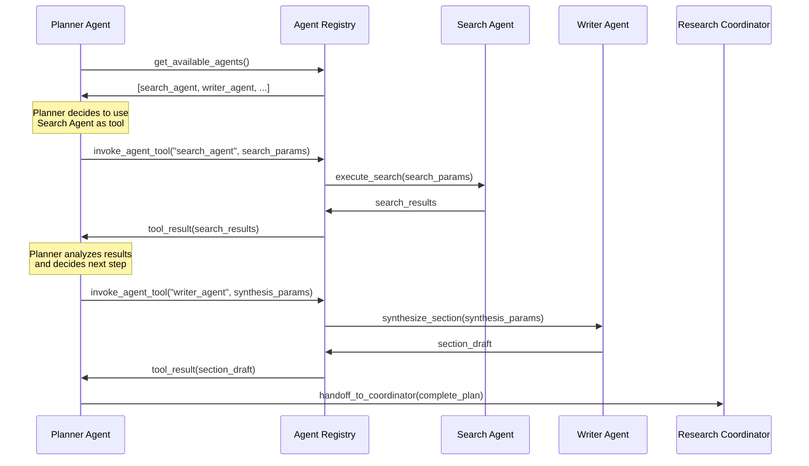
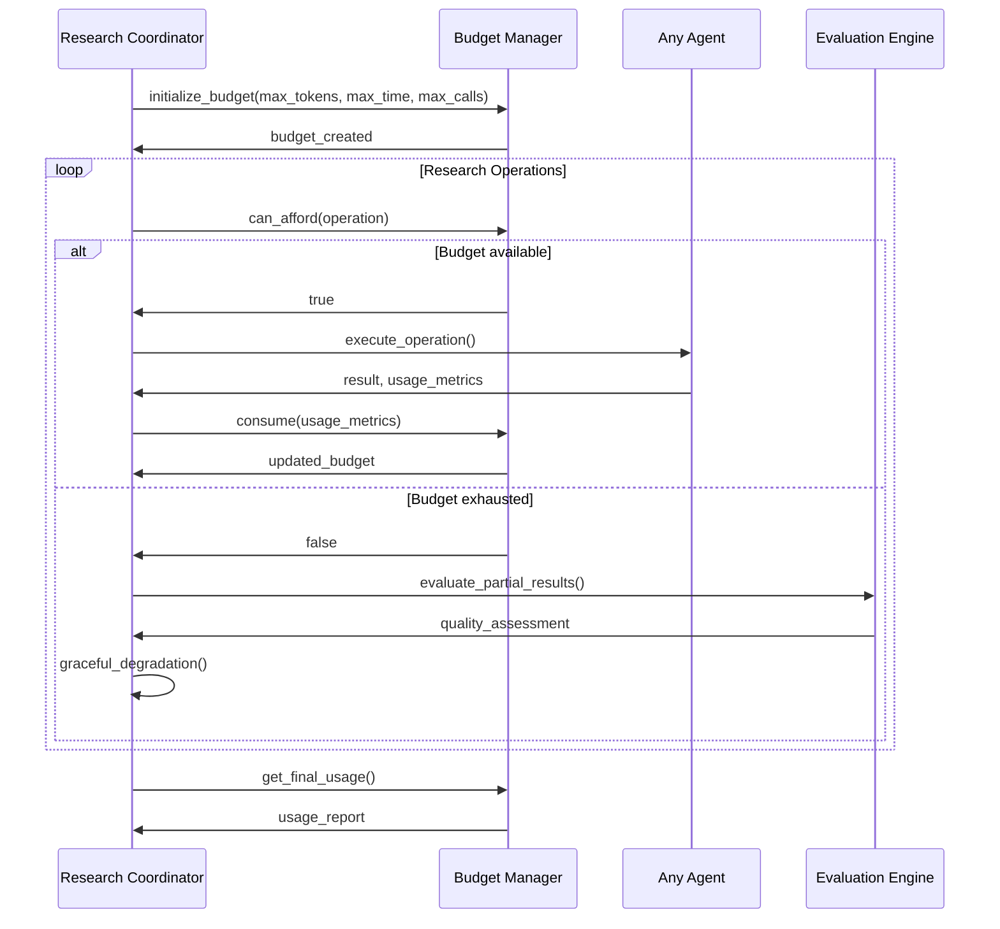

# Design Document

## Overview

The Autonomous Deep Research System transforms the existing linear research pipeline into an intelligent, multi-agent ecosystem with autonomous decision-making capabilities. The system employs a hub-and-spoke architecture with a central Research Coordinator managing specialized agents, evaluation loops, and resource allocation.

## Architecture

### High-Level Architecture

```
┌─────────────────────────────────────────────────────────────────┐
│                    Research Coordinator                         │
│  ┌─────────────────┐  ┌─────────────────┐  ┌─────────────────┐ │
│  │ State Machine   │  │ Budget Manager  │  │ Context Store   │ │
│  └─────────────────┘  └─────────────────┘  └─────────────────┘ │
└─────────────────────────────────────────────────────────────────┘
                                │
                ┌───────────────┼───────────────┐
                │               │               │
        ┌───────▼──────┐ ┌──────▼──────┐ ┌─────▼──────┐
        │ Agent        │ │ Evaluation  │ │ Clarification│
        │ Registry     │ │ Engine      │ │ Engine      │
        └──────────────┘ └─────────────┘ └────────────┘
                │
    ┌───────────┼───────────┐
    │           │           │
┌───▼───┐ ┌─────▼─────┐ ┌──▼──────┐
│Planner│ │ Search    │ │ Writer  │
│Agent  │ │ Agent     │ │ Agent   │
└───────┘ └───────────┘ └─────────┘
```

### Interaction Flow

The following sequence diagram illustrates a typical autonomous research session with clarification, evaluation loops, and trail following:



### Agent Collaboration Flow

This diagram shows how agents can invoke each other as tools through the Agent Registry:



### Budget Management Flow

This diagram illustrates how budget is tracked and enforced across the system:



### Core Components

#### Research Coordinator
- **State Machine**: Manages research workflow states (Planning, Searching, Evaluating, Synthesizing)
- **Budget Manager**: Tracks and enforces resource limits (tokens, time, API calls)
- **Context Store**: Maintains research context across agent handoffs
- **Trail Manager**: Manages autonomous research trail exploration
- **Handoff Controller**: Orchestrates agent-to-agent handoffs

#### Agent Registry
- **Capability Catalog**: Maps agent capabilities to available tools
- **Agent Wrapper**: Exposes agents as callable tools for other agents
- **Load Balancer**: Distributes work across available agent instances
- **Health Monitor**: Tracks agent availability and performance

#### Evaluation Engine
- **Quality Assessor**: Evaluates research quality using multiple metrics
- **Gap Detector**: Identifies missing information and research gaps
- **Credibility Scorer**: Assesses source reliability and information confidence
- **Synthesis Validator**: Ensures coherent integration of findings

#### Clarification Engine
- **Question Generator**: Creates relevant clarifying questions from queries
- **Ambiguity Detector**: Identifies unclear aspects of research requests
- **Context Analyzer**: Generates questions based on research findings
- **Response Processor**: Incorporates user clarifications into research context

## Components and Interfaces

### Research Coordinator Interface

```
class ResearchCoordinator:
    async def conduct_research(query: str, budget: ResearchBudget) -> ResearchResult
    async def request_clarification(context: ResearchContext) -> List[Question]
    async def follow_trail(trail: ResearchTrail, budget: ResearchBudget) -> TrailResult
    async def handoff_to_agent(agent_id: str, context: HandoffContext) -> AgentResult
    async def evaluate_quality(findings: List[Finding]) -> QualityReport
```

### Agent Registry Interface

```
class AgentRegistry:
    def register_agent(agent: Agent, capabilities: List[Capability]) -> None
    def get_agent_for_capability(capability: Capability) -> Optional[Agent]
    def wrap_agent_as_tool(agent_id: str) -> Tool
    def get_available_agents() -> List[AgentInfo]
    async def invoke_agent_tool(agent_id: str, input: Any) -> Any
```

### Evaluation Engine Interface

```
class EvaluationEngine:
    async def assess_quality(findings: List[Finding]) -> QualityScore
    async def detect_gaps(query: str, findings: List[Finding]) -> List[Gap]
    async def score_credibility(sources: List[Source]) -> CredibilityReport
    async def validate_synthesis(report: Report) -> ValidationResult
```

### Research State Machine

```
States:
- INITIALIZING: Setting up research context and budget
- CLARIFYING: Gathering clarifications from user
- PLANNING: Creating initial research plan
- SEARCHING: Executing search operations
- EVALUATING: Assessing research quality and gaps
- TRAIL_FOLLOWING: Autonomous exploration of interesting leads
- SYNTHESIZING: Combining findings into coherent report
- COMPLETED: Research finished, report generated
- FAILED: Research failed due to budget/quality constraints

Transitions:
- INITIALIZING → CLARIFYING (if ambiguities detected)
- INITIALIZING → PLANNING (if query is clear)
- CLARIFYING → PLANNING (after clarifications received)
- PLANNING → SEARCHING (plan approved)
- SEARCHING → EVALUATING (searches completed)
- EVALUATING → TRAIL_FOLLOWING (if gaps found and budget allows)
- EVALUATING → SYNTHESIZING (if quality sufficient)
- TRAIL_FOLLOWING → EVALUATING (trails completed)
- SYNTHESIZING → COMPLETED (report generated)
- Any State → FAILED (budget exhausted or critical failure)
```

## Data Models

### Research Context

```
class ResearchContext:
    query: str
    clarifications: Dict[str, str]
    findings: List[Finding]
    research_trails: List[ResearchTrail]
    budget_used: ResourceUsage
    quality_scores: List[QualityScore]
    handoff_history: List[HandoffRecord]
```

### Research Budget

```
class ResearchBudget:
    max_tokens: int
    max_time_seconds: int
    max_api_calls: int
    max_trail_depth: int
    current_usage: ResourceUsage
    
    def can_afford(operation: Operation) -> bool
    def consume(operation: Operation) -> None
    def remaining() -> ResourceUsage
```

### Research Trail

```
class ResearchTrail:
    id: str
    origin_finding: Finding
    trail_query: str
    relevance_score: float
    budget_allocated: ResearchBudget
    findings: List[Finding]
    status: TrailStatus
```

### Quality Score

```
class QualityScore:
    completeness: float  # 0-1 scale
    credibility: float   # 0-1 scale
    relevance: float     # 0-1 scale
    confidence: float    # 0-1 scale
    overall: float       # weighted average
    gaps_identified: List[Gap]
```

## Error Handling

### Budget Exhaustion
- Graceful degradation when budget limits reached
- Prioritize completion of high-value research streams
- Generate partial reports with confidence indicators
- Clear communication to user about budget constraints

### Agent Failures
- Automatic retry with exponential backoff
- Fallback to alternative agents for same capability
- Graceful degradation of functionality
- Detailed error logging and user notification

### Quality Gate Failures
- Halt research progression when quality thresholds not met
- Request user intervention for direction
- Suggest alternative research approaches
- Maintain research state for resumption

### Loop Detection
- Track research paths and agent call chains
- Detect circular dependencies in agent tool usage
- Implement circuit breakers for recursive calls
- Breadcrumb system for trail following

## Testing Strategy

### Unit Testing
- Individual agent functionality and interfaces
- Budget management and resource tracking
- State machine transitions and validation
- Quality scoring algorithms

### Integration Testing
- Agent handoff workflows
- Multi-agent collaboration scenarios
- Budget enforcement across agent boundaries
- End-to-end research workflows

### Performance Testing
- Concurrent agent execution
- Resource utilization under load
- Response time optimization
- Memory usage profiling

### Quality Testing
- Research output quality validation
- Comparison with baseline system
- User satisfaction metrics
- Accuracy of gap detection

## Security Considerations

### Resource Protection
- Strict budget enforcement to prevent runaway processes
- Rate limiting on external API calls
- Timeout mechanisms for long-running operations
- Memory usage monitoring and limits

### Data Privacy
- Secure handling of research context and findings
- Encryption of sensitive research data
- Access control for agent capabilities
- Audit logging of all research activities

### Agent Isolation
- Sandboxed execution environments for agents
- Controlled inter-agent communication
- Validation of agent tool inputs and outputs
- Prevention of malicious agent behavior

## Performance Optimization

### Parallel Execution
- Concurrent research streams where possible
- Asynchronous agent communication
- Parallel search operations
- Background quality evaluation

### Caching Strategy
- Cache frequently accessed research data
- Memoization of expensive operations
- Intelligent cache invalidation
- Distributed caching for agent results

### Resource Management
- Dynamic agent scaling based on workload
- Intelligent work distribution
- Memory pool management
- Connection pooling for external services

---

*"The key to autonomous research isn't just making agents smarter - it's making them work together like a well-oiled space station crew." - TARS*